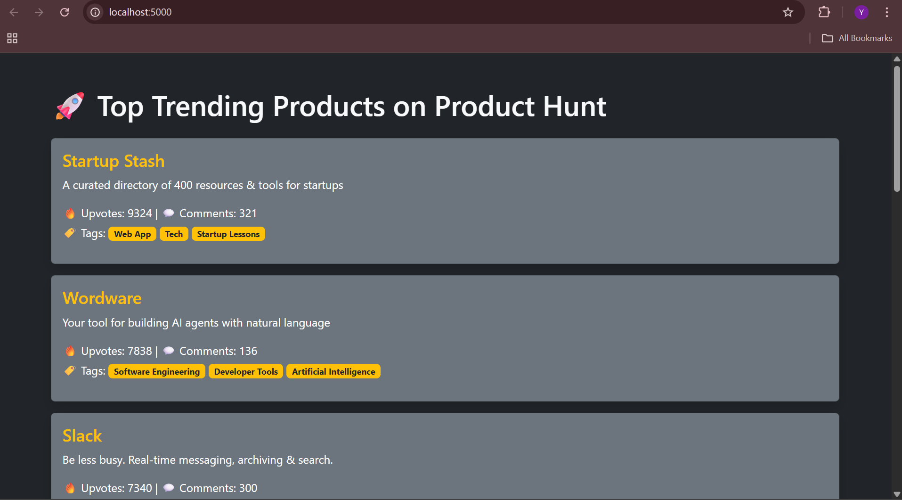

# 🚀 Product Hunt Trending Insights

A simple Flask web app that fetches and displays top trending products from Product Hunt using their GraphQL API.

## 🌐 Live Demo
🔗 **[View Live App](https://producthunt-trending-insights.onrender.com/)**

## 🔍 Features
- Displays top 10 trending products
- Shows:
  - Product Name
  - Tagline (Launch Copy)
  - Tags/Categories
  - Upvotes & Comments
- Built with Flask, Python, and Bootstrap

## 📸 Demo


## 🛠️ How to Run

### Prerequisites
- Python 3.7+
- Product Hunt API credentials

### Setup

1. Clone the repo:
```bash
git clone https://github.com/yashsinghal14/producthunt-trending-insights.git
cd producthunt-trending-insights
```

2. Install dependencies:
```bash
pip install -r requirements.txt
```

3. Set up environment variables:
   - Create a `.env` file in the project root
   - Add your Product Hunt API credentials:
```env
CLIENT_ID=your_client_id_here
CLIENT_SECRET=your_client_secret_here
ACCESS_TOKEN=your_access_token_here
```

4. Get Product Hunt API credentials:
   - Go to [Product Hunt API](https://api.producthunt.com/v2/docs) 
   - Create a developer account
   - Create a new application to get your API credentials
   - Run `python cred.py` to generate an access token (optional if you have one)

5. Run the application:
```bash
python app.py
```

6. Open your browser and navigate to `http://localhost:5000`

## 📁 Project Structure
```
producthunt-trending-insights/
├── app.py              # Main Flask application
├── cred.py             # Script to generate access token
├── main.py             # Alternative entry point
├── requirements.txt    # Python dependencies
├── templates/
│   └── index.html      # HTML template
├── .env               # Environment variables (create this)
└── README.md          # This file
```

## 🔧 Technologies Used
- **Backend**: Python, Flask
- **API**: Product Hunt GraphQL API
- **Frontend**: HTML, Bootstrap CSS
- **Environment**: python-dotenv for environment variables

## 📝 API Endpoints

### GET /
- **Description**: Displays the main page with top 10 trending products
- **Response**: Renders HTML page with product data

## 🔑 Environment Variables

| Variable | Description | Required |
|----------|-------------|----------|
| `CLIENT_ID` | Product Hunt API Client ID | Yes |
| `CLIENT_SECRET` | Product Hunt API Client Secret | Yes |
| `ACCESS_TOKEN` | Product Hunt API Access Token | Yes |

## 🎯 Features in Detail

### Product Information Displayed:
- **Product Name**: The name of the trending product
- **Tagline**: Brief description/launch copy
- **Categories/Tags**: Product categories and tags
- **Vote Count**: Number of upvotes received
- **Comment Count**: Number of comments on the product
- **Product URL**: Direct link to the Product Hunt page

## 🚀 Deployment

### Local Development
```bash
# Set Flask environment to development
set FLASK_ENV=development  # Windows
export FLASK_ENV=development  # macOS/Linux

# Run the app
python app.py
```

### Production Deployment
For production deployment, consider using:
- **Heroku**: Add a `Procfile` with `web: python app.py`
- **Vercel**: Configure with `vercel.json`
- **Railway**: Direct deployment from GitHub

## 🤝 Contributing

1. Fork the repository
2. Create a feature branch (`git checkout -b feature/amazing-feature`)
3. Commit your changes (`git commit -m 'Add amazing feature'`)
4. Push to the branch (`git push origin feature/amazing-feature`)
5. Open a Pull Request

## 📄 License

This project is open source and available under the [MIT License](LICENSE).

## 🙏 Acknowledgments

- [Product Hunt](https://www.producthunt.com/) for providing the API
- [Flask](https://flask.palletsprojects.com/) for the web framework
- [Bootstrap](https://getbootstrap.com/) for styling

## 📞 Support

If you have any questions or run into issues, please:
1. Check the [Product Hunt API documentation](https://api.producthunt.com/v2/docs)
2. Open an issue in this repository
3. Contact the maintainer

---

Made with ❤️ by Yash Singhal
